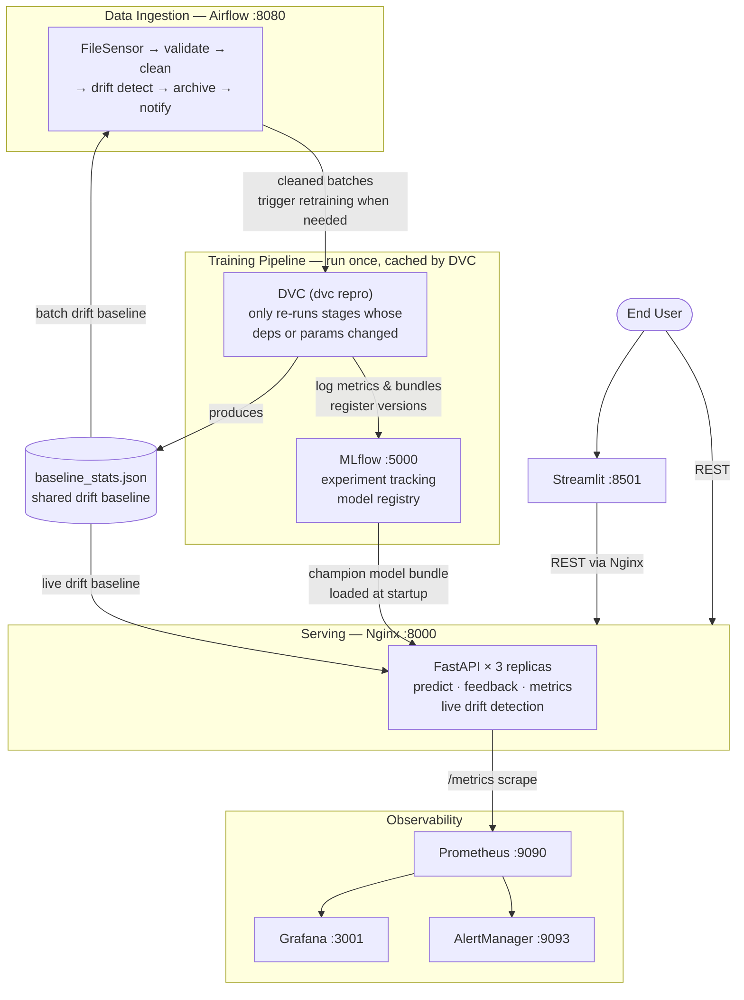
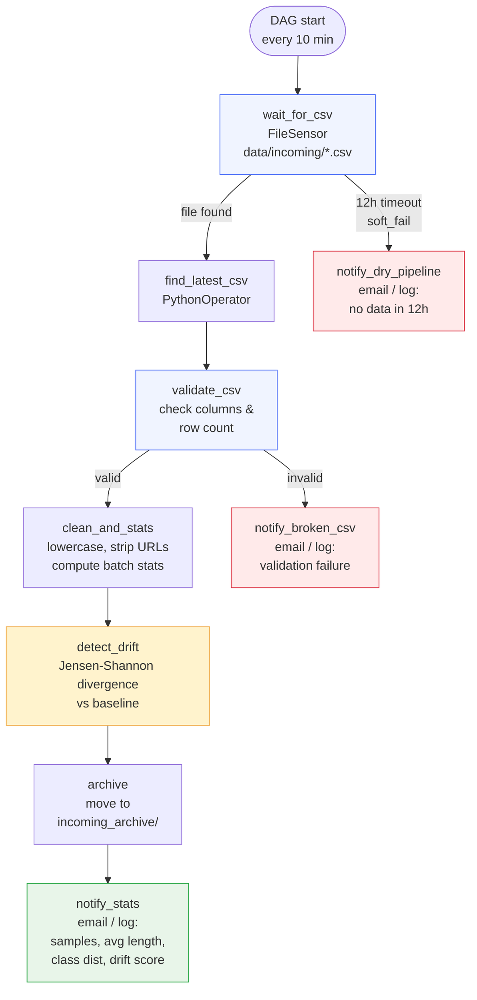
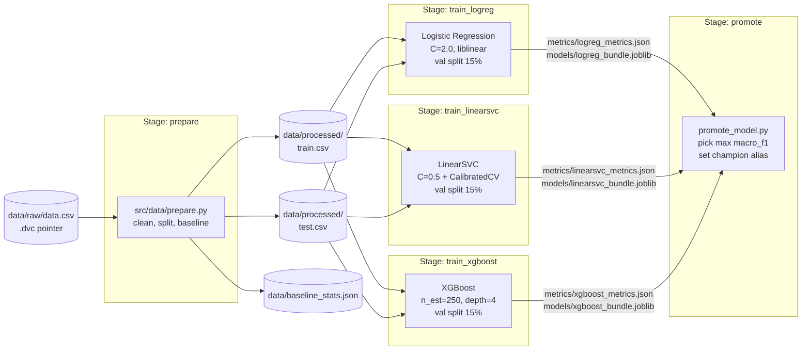
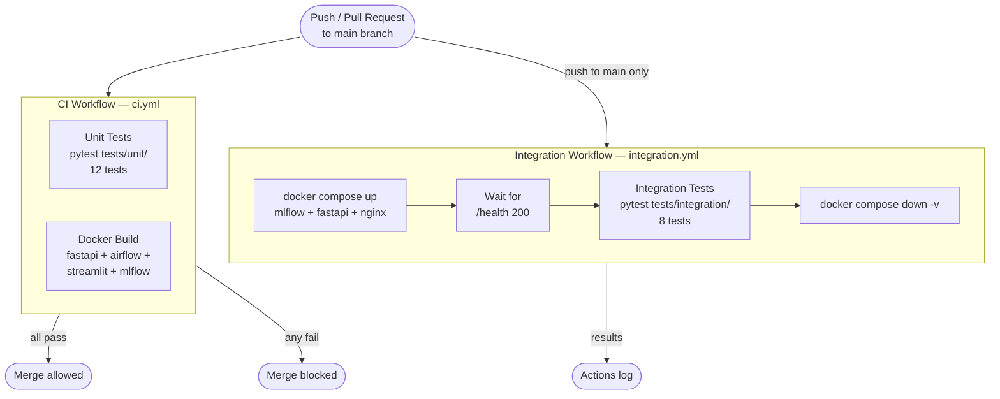
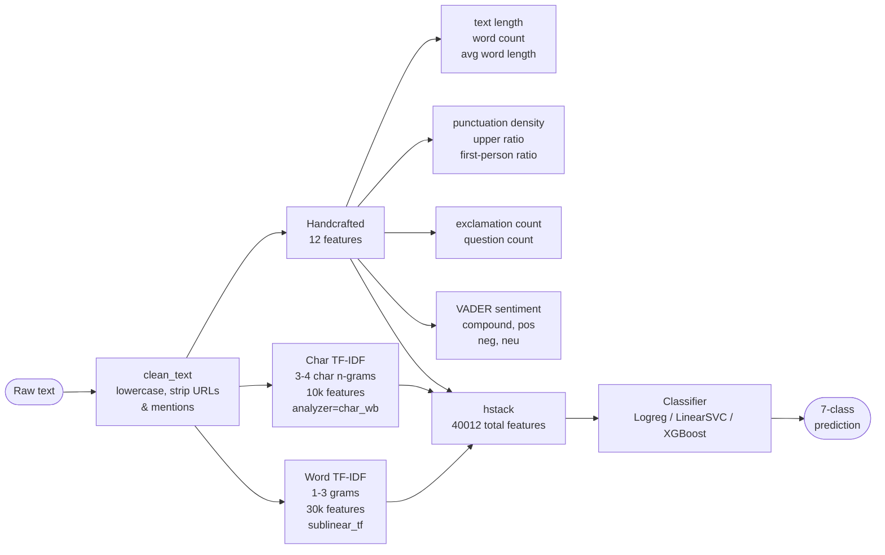

# Architecture Diagrams

## 1. System Overview



---

## 2. Data Flow

```mermaid
flowchart LR
    RAW([("data/raw/data.csv\nKaggle dataset")])

    subgraph DVC["DVC Pipeline  —  stage-cached, only reruns on change"]
        PREP["prepare\nclean · split · compute baseline\n─────────────────\nout: train.csv · test.csv\n     baseline_stats.json"]
        LR["train_logreg\nTF-IDF + handcrafted → LogReg\nval split 15% · logs to MLflow"]
        SV["train_linearsvc\nTF-IDF + handcrafted → SVC\nval split 15% · logs to MLflow"]
        XG["train_xgboost\nTF-IDF + handcrafted → XGBoost\nval split 15% · logs to MLflow"]
        PRO["promote\npick best macro-F1\nset champion alias"]
        PREP --> LR & SV & XG --> PRO
    end

    RAW --> PREP
    PRO -->|"champion alias"| MLB[(MLflow\nRegistry)]
    PREP -->|"baseline_stats.json"| BASE[("baseline_stats.json")]

    INCOMING([("data/incoming/*.csv\nnew data batches")])

    subgraph AF["Airflow  —  data_prep_pipeline  (every 10 min)"]
        V[validate] --> C[clean] --> D["detect drift\nJSD vs baseline"] --> A[archive]
    end

    INCOMING -->|"FileSensor"| AF
    BASE -->|"drift baseline"| D
    C -.->|"cleaned batches\nfor future retraining"| PREP

    MLB -->|"champion bundle"| FA2

    subgraph FA2["FastAPI × 3  (Nginx :8000)"]
        P["/predict · /feedback\n/metrics · /model_info"]
    end

    BASE -->|"live drift baseline"| FA2
    User([User]) <-->|"text in\nclass + confidence out"| FA2
    FA2 -->|"metrics"| PR[Prometheus\n:9090]
    PR --> GR[Grafana\n:3001]
    PR -->|"fire alerts"| AM[AlertManager\n:9093]
```

---

## 3. Airflow DAG



---

## 4. DVC Pipeline



---

## 5. CI/CD Pipeline



---

## 6. Feature Engineering Pipeline


