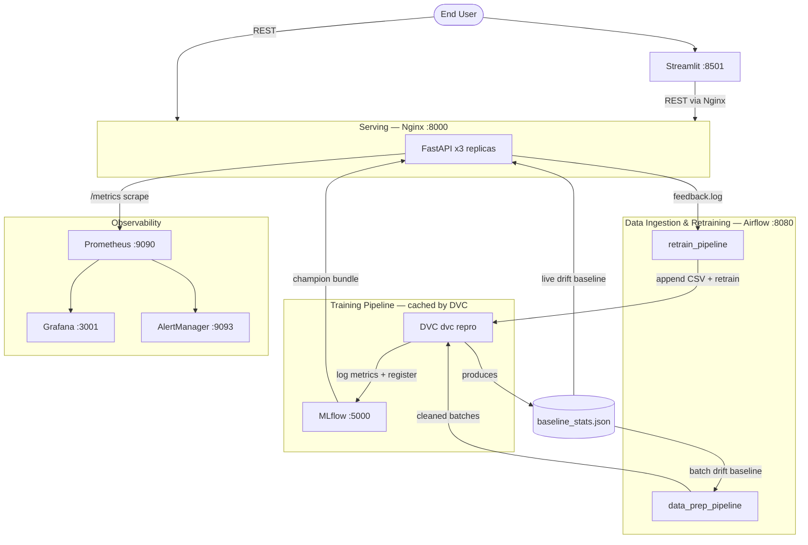
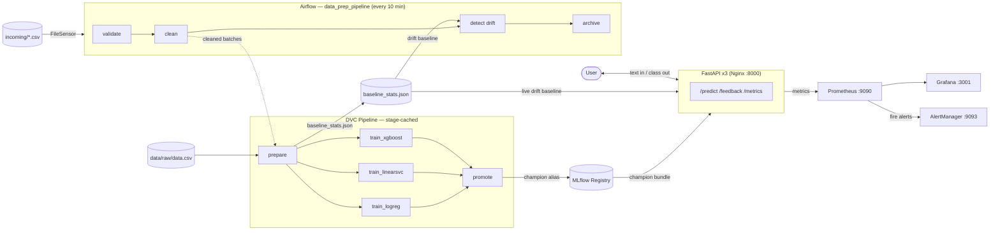
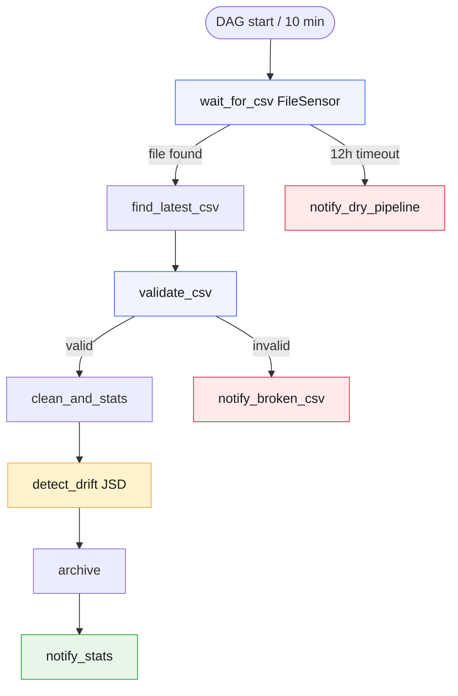
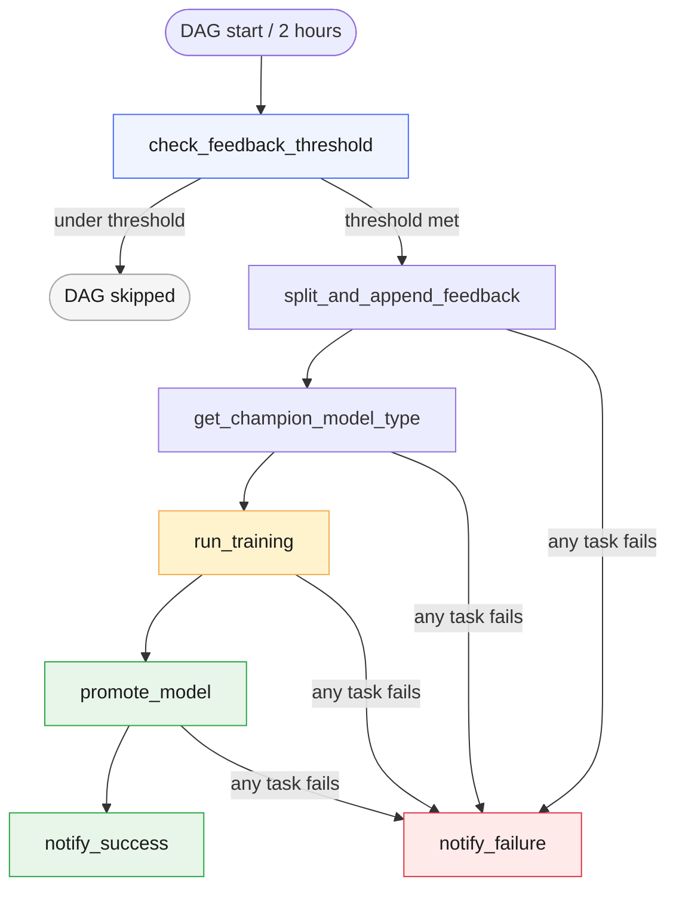
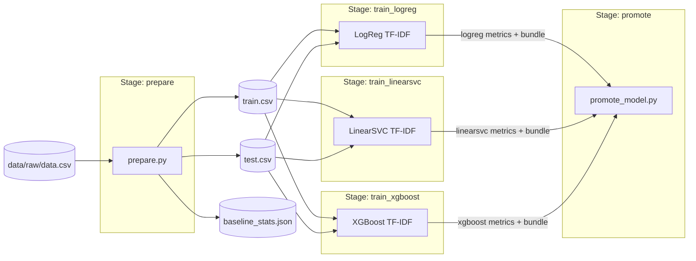
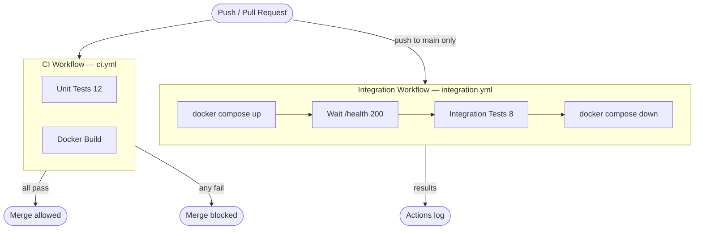
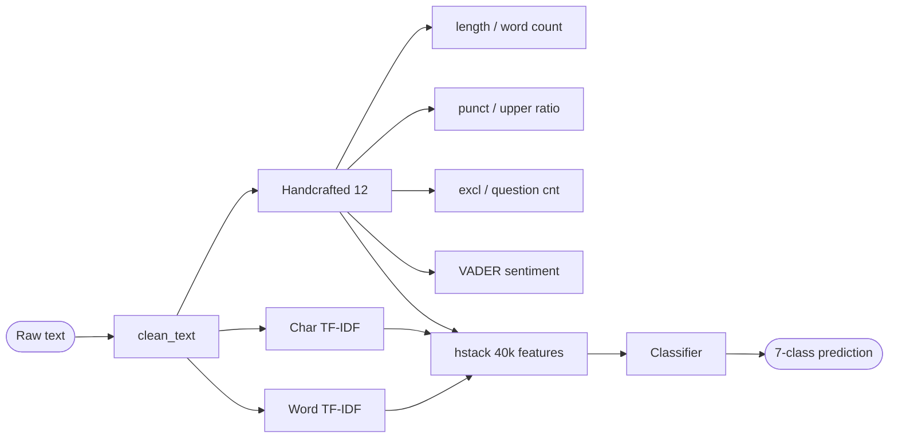

# Architecture Diagrams

## 1. System Overview

---

## 2. Data Flow

---

## 3. Airflow DAG

---

## 3b. Airflow DAG — `retrain_pipeline`

---

## 4. DVC Pipeline

---

## 5. CI/CD Pipeline

---

## 6. Feature Engineering Pipeline

